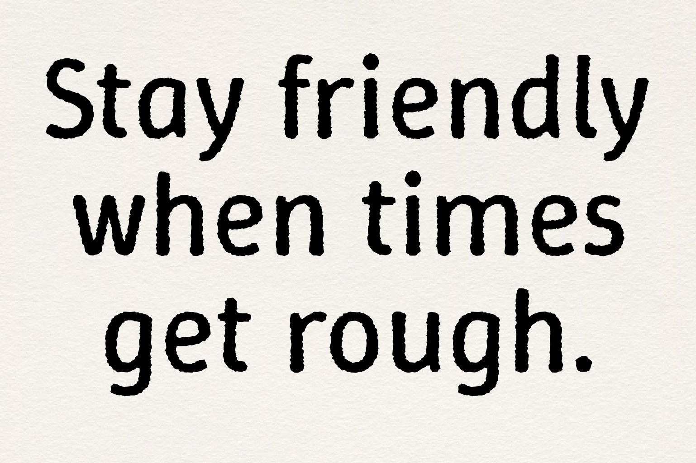

----

# My Font

[![][Fontbakery]](https://typofactur.github.io/winkyrough/fontbakery/fontbakery-report.html)
[![][Universal]](https://typofactur.github.io/winkyrough/fontbakery/fontbakery-report.html)
[![][GF Profile]](https://typofactur.github.io/winkyrough/fontbakery/fontbakery-report.html)
[![][Shaping]](https://typofactur.github.io/winkyrough/fontbakery/fontbakery-report.html)

[Fontbakery]: https://img.shields.io/endpoint?url=https%3A%2F%2Fraw.githubusercontent.com%2Ftypofactur%2Fwinkyrough%2Fgh-pages%2Fbadges%2Foverall.json
[GF Profile]: https://img.shields.io/endpoint?url=https%3A%2F%2Fraw.githubusercontent.com%2Ftypofactur%2Fwinkyrough%2Fgh-pages%2Fbadges%2FGoogleFonts.json
[Outline Correctness]: https://img.shields.io/endpoint?url=https%3A%2F%2Fraw.githubusercontent.com%2Ftypofactur%2Fwinkyrough%2Fgh-pages%2Fbadges%2FOutlineCorrectnessChecks.json
[Shaping]: https://img.shields.io/endpoint?url=https%3A%2F%2Fraw.githubusercontent.com%2Ftypofactur%2Fwinkyrough%2Fgh-pages%2Fbadges%2FShapingChecks.json
[Universal]: https://img.shields.io/endpoint?url=https%3A%2F%2Fraw.githubusercontent.com%2Ftypofactur%2Fwinkyrough%2Fgh-pages%2Fbadges%2FUniversal.json

Winky Rough is the roughed variant of Winky Sans (https://github.com/typofactur/winkysans) imitating handwriting and dried ink on rough paper.

Unlike its counterpart Winky Sans, Winky Rough is not a variable font (yet). 
Winky Rough is available in seven weights from Light (300) to Black (900) and matching italic styles.
Watch out! Like flowing ink on paper the forms grows in all directions. While the slim weights might have been written with a fineliner, the black style look like ink blots from a broken pen.

## About

typofactur is a German type foundry run by the graphic designer Simon Atzbach.
Find out more at https://typofactur.de

## Building

Fonts are built automatically by GitHub Actions - take a look in the "Actions" tab for the latest build.

If you want to build fonts manually on your own computer:

* `make build` will produce font files.
* `make test` will run [FontBakery](https://github.com/googlefonts/fontbakery)'s quality assurance tests.
* `make proof` will generate HTML proof files.

The proof files and QA tests are also available automatically via GitHub Actions - look at https://typofactur.github.io/winkyrough.git.

## Changelog

**27 December 2024. Version 1.002**
- initial release
- roughness 15/15/10
- seven static weights (no variable font)

**04 January 2025. Version 1.005**
- jacute
- width math signs (greaterequal, plusminus)
- commaturndedabove deleted
- dottedCircle added
- no ligatures

**05 January 2025. Version 1.100**
- Italic added
- glyphspackage instead of glyphs
- kerning with Kern On
- L

**20 January 2025. Version 1.200**
- reduced from 7 to 3 masters, fully interpolable

**21 January 2025. Version 1.201**
- dcroat
- OE

**21 January 2025. Version 1.202**
- semicolon

## License

This Font Software is licensed under the SIL Open Font License, Version 1.1.
This license is available with a FAQ at https://openfontlicense.org

## Repository Layout

This font repository structure is inspired by [Unified Font Repository v0.3](https://github.com/unified-font-repository/Unified-Font-Repository), modified for the Google Fonts workflow.
